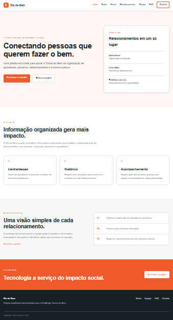
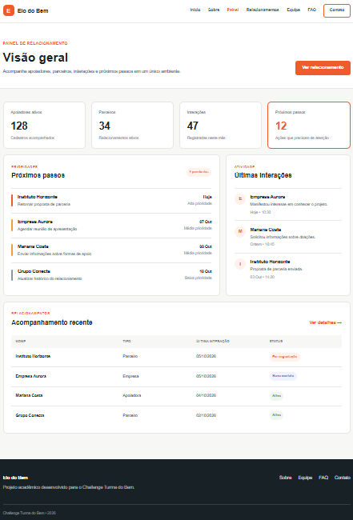

# Elo do Bem

Projeto desenvolvido para o Challenge Turma do Bem da FIAP.

O Elo do Bem é uma proposta de plataforma para auxiliar a Turma do Bem na organização de seus relacionamentos com apoiadores, parceiros e empresas.

A solução busca centralizar informações importantes, como contatos, histórico de interações e próximos passos de cada relacionamento.

## Objetivo

O objetivo do projeto é apresentar uma solução que facilite a organização e o acompanhamento dos relacionamentos da Turma do Bem.

Nesta primeira Sprint foi desenvolvido um protótipo estático utilizando HTML e CSS.

## Funcionalidades apresentadas

O projeto possui as seguintes páginas:

- Início
- Sobre
- Painel
- Relacionamentos
- Equipe
- FAQ
- Contato

O Painel apresenta uma visão geral dos relacionamentos cadastrados e das atividades pendentes.

A página de Relacionamentos apresenta o detalhamento de um parceiro fictício, incluindo histórico de interações e próximo passo.

Os dados apresentados no protótipo são fictícios e utilizados apenas para demonstração da solução.

## Tecnologias utilizadas

- HTML5
- CSS3
- Flexbox
- CSS Grid
- Git
- GitHub

## Estrutura do projeto

```text
elo-do-bem/
│
├── css/
│   └── style.css
│
├── imagens/
│   ├── gabriel.jpeg
│   ├── joao.jpeg
│   └── kaio.jpeg
│
├── imagens-projeto/
│   ├── home.png
│   └── painel.png
│
├── index.html
├── sobre.html
├── painel.html
├── relacionamento.html
├── integrantes.html
├── faq.html
├── contato.html
└── README.md

## Integrantes

Gabriel Henrique
RM: RM576855
Turma: 1TDSPB
GitHub: https://github.com/GabrielHenriqueDantas
LinkedIn: https://www.linkedin.com/in/gabriel-h-dantas/

João Pedro Paseto
RM: RM576879
Turma: 1TDSPB
GitHub: https://github.com/JoaoPaseto
LinkedIn: https://www.linkedin.com/in/jo%C3%A3o-pedro-macedo-paseto-09150729b/

Kaio César
RM: RM575944
Turma: 1TDSPB
GitHub: https://github.com/okaioccesar
LinkedIn: https://www.linkedin.com/in/okaioccesar/

## Como visualizar o projeto
O projeto pode ser executado localmente abrindo o arquivo index.html em um navegador.
Também está disponível online através do GitHub Pages.

Site do projeto:
https://gabrielhenriquedantas.github.io/elo-do-bem/

Repositório:
https://github.com/GabrielHenriqueDantas/elo-do-bem

## Imagens do projeto

### Página inicial



### Painel


 
## Contato

Para informações sobre o projeto, entre em contato com os integrantes através dos perfis do GitHub ou LinkedIn disponíveis neste README.

Observações

Este projeto corresponde à primeira Sprint do Challenge Turma do Bem.
Nesta etapa, a solução foi desenvolvida como um protótipo estático, sem utilização de JavaScript, frameworks ou bibliotecas externas.